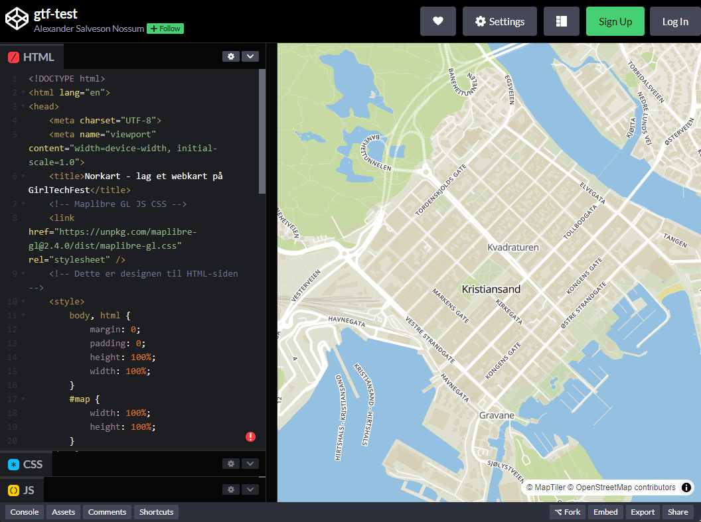
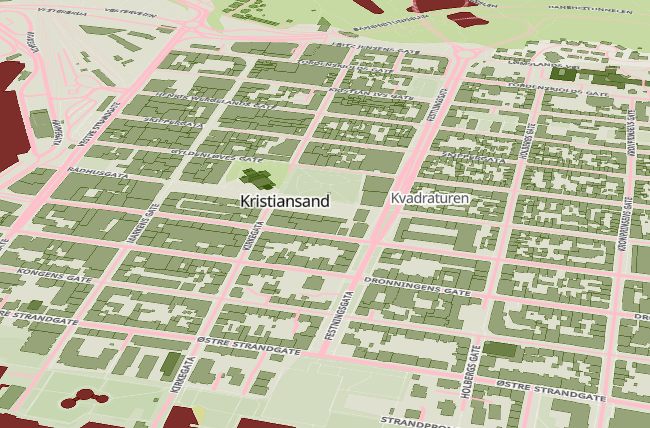

# GirlTechFest
Opplegg for GirlTechFest i Kristiansand

Nå skal du lære hvordan kart på web fungerer. Du skal lage ditt eget kart med dine egne farger. Kanskje får du til å lage et 3D-kart også!

Vi skal jobbe i nettleseren. Oppgavene ligger under. Følg oppgavene steg for steg. Husk å lese oppgavene nøye. Programmering må være helt nøyaktig og riktig for at datamaskinen skal skjønne det. Spør en av veilederne hvis du står fast. 

# Lag ditt eget kart!

## Oppgave 1: Lag ditt eget kart
I denne oppgaven skal du sette opp webkartet og sette startpunktet til skolen din.

Vi skal bruke en kode-editor i nettleseren som heter CodePen. 

Gå inn linken til CodePen for å åpne første oppgave: [https://codepen.io/](https://codepen.io/Alexander-Salveson-Nossum/pen/QWepGqz?editors=1000). Det skal se omtrent slik ut:

<br>



Først skal du skrive inn gruppenavnet ditt
```html
<h1 id="header">Gruppenavnet ditt</h1>
```

Nå skal du endre på startpunktet for kartet. Finn koden for dette og bytt til senterpunktet for din skole, eller det du har lyst til! 
```javascript
//senterpunktet for kartet
let senterpunkt = [7.995611, 58.146722];
```

Dette er koordinater i grader [ØST, NORD]. Under er en del koordinater for skoler i Kristiansand

```javascript
// Koordinater for skoler i Kristiansand (longitude, latitude)
let senterpunkt = [8.034680729216566, 58.17959886921729];  // Fagerholt skole
let senterpunkt = [8.016726338663457, 58.155842612163845];  // International School of Kristiansand
let senterpunkt = [8.009256541248622, 58.1566247525529];  // Lovisenlund skole
let senterpunkt = [8.024355946062418, 58.14965140664508];  // Wilds Minne skole
let senterpunkt = [7.925112198424519, 58.20135148214101];  // Torridal skole

// Andre morsomme
let senterpunkt = [-81.901693, 41.303921];
let senterpunkt = [-0.55462, 51.848637];
let senterpunkt = [-63.987, -33.867886];
let senterpunkt = [15.382, 43.978];
```

Får du til å endre zoom-nivået også? 

## Oppgave 2: Fargelegg kartet ditt
Kartet du har lagd, fargelegges direkte i nettleseren. Det betyr at vi kan endre på designen til de delene av kartet vi bestemmer. 

Du må først aktivere fargelegging ved å endre koden til å vise 'true'. Den vises som 'false' nå
```javascript
//denne må du sette til 'true' for å aktivere fargelegging av kartet
let fargelegg = true;
```

Nå kan du endre fargene i kartet ved å endre fargene under. Du finner flere eksempler på fargekoder du kan bruke nederst i dokumentet og på arket du har fått utdelt. Lag det kuleste, sprøeste eller fineste kartet dere får til! 

Når du er fornøyd kan du trykke på "Skriv ut" for å skrive ut ditt spesial-designede kart! Gratulerer! 

```javascript
// Her setter vi fargene til kartet
let bakgrunnsfarge = 'green'
let veifarge = 'red';
let bygningsfarge = 'salmon';
let vannfarge = 'pink';
let skogfarge = 'red';
let gressfarge = 'orange'
let jernbanefarge = 'black'
let boligfarge = 'black';
```

-----
-----


# Lag et 3D-kart!
Til nå har vi bare sett kartet rett ovenfra i 2D. Kartdata er ofte 3D-data. Nå skal vi se kartet i perspektiv og sette 3D-høyder på datalagene.

## Oppgave1: Vis kartet i 3D
Gå inn på [CodePen 3D](https://codepen.io/Alexander-Salveson-Nossum/pen/WNVpoYW?editors=1000). 

(Hvis du vil kan du kopiere senterpunkt og fargene dine fra den forrige oppgaven!)

Nå skal du først aktivere 3D-modusen. Det gjør du ved å endre variabelen 'perspektiv' til 'true'. 

```javascript
//denne må du sette til 'true' for å aktivere 3D i kartet
let perspektiv = true;
```

Nå kan du rotere og "vri" på kartet ved å trykke "ctrl" og museklikk i kartet. Du kan også bruke høyre-musetast og bevege deg rundt. 




## Oppgave2: Legg til 3D-visning av datalag
Nå skal vi få bygningene til å bli i 3D. Da må du sette en _skaleringsfaktor_ til høyden på bygningene. Dette gjør du ved å endre tallet til _bygning_skalering_. Prøv deg frem og se forskjellene! Hvorfor går det ikke med negative tall?

```javascript
//denne bestemmer skalering av høyden til bygninger i 3D
let bygning_skalering = 0;
```

## Oppgave3: La vannet bli høyere
Kartet trenger ikke bare vise det som er realistisk. Vi kan også legge til 3D-effekt på andre datalag. Nå skal vi legge til 3D-effekt på vannet(!). Da kan vi sette en fast høyde på vannet og se hva som skjer. Prøv deg frem med forskjellig høyder! Hva kan du bruke dette til? 

```javascript
//denne bestemmer høyden til vannflaten i 3D
let vannheight = 0;
```

Når du er fornøyd kan du trykke på "Skriv ut" for å printe kartet ditt! 


--------

# Teori og oppslag
## Webutvikling

Webutvikling handler om å lage nettsteder og applikasjoner som vi kan bruke på internett. Det er som å bygge et hus, der hver del har sin egen funksjon.

### 1. HTML (HyperText Markup Language)

HTML er grunnlaget for enhver nettside. Tenk på HTML som skjelettet til et hus. Den forteller nettleseren hva som skal vises på siden. For eksempel, hvis du vil ha en overskrift, bruker du HTML for å lage den. Du kan også bruke HTML til å sette inn tekst, bilder og lenker. Så når du besøker en nettside, er det HTML som forteller nettleseren hva den skal vise og hvor alt skal være.

### 2. CSS (Cascading Style Sheets)

Når skjelettet er bygget med HTML, er det tid for å pynte det. Det er her CSS kommer inn. CSS fungerer som maling og dekorasjoner for huset. Det bestemmer hvordan nettsiden ser ut, for eksempel hvilken farge bakgrunnen skal ha, hvilken skrifttype teksten skal bruke, og hvordan bilder skal plasseres. Med CSS kan du gjøre en nettside både fin og spennende å se på!

### 3. JavaScript

JavaScript gir liv til nettsiden. Tenk på det som lysene og bevegelsene i huset. Med JavaScript kan du lage interaktive funksjoner, som å vise en melding når du klikker på en knapp eller endre bildet som vises. Det gjør at nettsiden kan reagere på hva brukeren gjør. For eksempel, når du fyller ut et skjema, kan JavaScript hjelpe til med å sjekke om du har skrevet inn alt riktig før du sender det.

### Oppsummering

Så, når vi lager en nettside, bruker vi HTML for å lage strukturen, CSS for å pynte den, og JavaScript for å gjøre den interaktiv. Sammen skaper de en spennende og brukervennlig opplevelse på nettet!

# Kartutvikling på Web med Vektortiles

Kartutvikling på web handler om å lage interaktive kart som brukere kan navigere i. Ved å bruke vektortiles kan vi lage kart som er både raske og fleksible. Her er en enkel forklaring på prosessen:

## 1. Hva er Vektortiles?

Vektortiles er små biter av kartdata som inneholder informasjon om geografiske elementer, som veier, elver, bygninger og annen infrastruktur. I motsetning til rasterbilder (som JPEG eller PNG), som er faste og kan miste kvalitet når de skaleres, er vektortiles laget av matematiske former. Dette gjør at de kan skaleres opp eller ned uten å miste kvalitet.

## 2. Hvordan Fungerer Vektortiles?

Når du navigerer på et kart, laster nettleseren inn vektortiles fra en server. Disse tilesene gir informasjon om hva som skal vises på kartet, avhengig av hvilket zoom-nivå du er på. For eksempel, når du zoomer inn, kan flere detaljer som bygninger og veier vises.

## 3. Enkel Styling av Kartet

Etter at vektortiles er lastet inn, kan du bruke CSS-lignende språk for å style kartet. Her er noen enkle måter å style vektortiles på:

- **Farger**: Endre fargene på veier, elver, og bygninger for å gjøre kartet mer visuelt tiltalende.
- **Typer**: Velg forskjellige linjetyper for veier, som stiplete eller solide, for å vise forskjeller mellom motorveier og småveier.
- **Ikoner**: Bruke ikoner for å representere steder, som restauranter eller parker, for å gjøre kartet mer informativt.

## 4. Bruke Kartbiblioteker

Det finnes mange biblioteker, som **Mapbox** eller **Leaflet**, som gjør det lettere å jobbe med vektortiles og styling. Disse bibliotekene gir ferdige verktøy for å laste inn vektortiles, håndtere interaktivitet, og style kartet.

## Oppsummering

Ved å bruke vektortiles kan du lage raske og skalerbare kart på weben. Med enkel styling kan du tilpasse kartet slik at det blir både informativt og estetisk. Dette gir en bedre brukeropplevelse og lar folk enkelt navigere i geografisk informasjon.


# Farger og webkoder
Farger må beskrives i koder for at datamaskinen skal forstå det. Under er noen ferdige fargekoder som bruker rgba-koder for å beskrive fargene. RGBA er Red Green Blue Alpha. Alpha er hvor gjennomsiktig fargen skal være. 

Det finnes mange ferdige paletter med farger for kart. Disse er egnet for å vise data i kart på en riktig måte. Vi har brukt http://colorbrewer2.org/ til å hente ut noen vanlige fargepaletter i tillegg til regnbuefargene. 
## Regnbuefarger

$${\color{rgba(255, 0, 0, 1)}rgba(255, 0, 0, 1)}$$ - Rød

$${\color{rgba(255, 127, 0, 1)}rgba(255, 127, 0, 1)}$$ - Oransje

$${\color{rgba(255, 255, 0, 1)}rgba(255, 255, 0, 1)}$$ - Gul

$${\color{rgba(0, 255, 0, 1)}rgba(0, 255, 0, 1)}$$ - Grønn

$${\color{rgba(0, 0, 255, 1)}rgba(0, 0, 255, 1)}$$ - Blå

$${\color{rgba(75, 0, 130, 1)}rgba(75, 0, 130, 1)}$$ - Indigo

$${\color{rgba(139, 0, 255, 1)}rgba(139, 0, 255, 1)}$$ - Fiolett

### Sekvensiell palett - gul-grønn-blå
Egnet til: Visning av data som har en naturlig rekkefølge, for eksempel fra lav til høy verdi

$${\color{rgba(255, 255, 204, 1)}rgba(255, 255, 204, 1)}$$ - Lys gul

$${\color{rgba(199, 233, 180, 1)}rgba(199, 233, 180, 1)}$$ - Lys grønn

$${\color{rgba(127, 205, 187, 1)}rgba(127, 205, 187, 1)}$$ - Pastellgrønn

$${\color{rgba(65, 182, 196, 1)}rgba(65, 182, 196, 1)}$$ - Sjøgrønn

$${\color{rgba(44, 127, 184, 1)}rgba(44, 127, 184, 1)}$$ - Kornblomstblå

### Sekvensiell palett: Lilla til rød
Egnet til: Data med en naturlig progresjon, for eksempel intensitet av fenomen, eks. populasjonstetthet, bygningshøyder, vanntemperatur

$${\color{rgba(247, 244, 249, 1)}rgba(247, 244, 249, 1)}$$ - Lys lilla

$${\color{rgba(231, 225, 239, 1)}rgba(231, 225, 239, 1)}$$ - Pastell lilla

$${\color{rgba(212, 185, 218, 1)}rgba(212, 185, 218, 1)}$$ - Lys lavendel

$${\color{rgba(201, 148, 199, 1)}rgba(201, 148, 199, 1)}$$ - Lys rosa-lilla

$${\color{rgba(223, 101, 176, 1)}rgba(223, 101, 176, 1)}$$ - Mørk rosa

### Divergerende palett: Rød til blå
Egnet til: Visualisering av data som går fra én ekstrem til en annen, f.eks. temperaturavvik eller politiske målinger.

$${\color{rgba(103, 0, 31, 1)}rgba(103, 0, 31, 1)}$$ - Mørk rød

$${\color{rgba(178, 24, 43, 1)}rgba(178, 24, 43, 1)}$$ - Rubinrød

$${\color{rgba(214, 96, 77, 1)}rgba(214, 96, 77, 1)}$$ - Korall

$${\color{rgba(244, 165, 130, 1)}rgba(244, 165, 130, 1)}$$ - Laks

$${\color{rgba(253, 219, 199, 1)}rgba(253, 219, 199, 1)}$$ - Lys fersken

$${\color{rgba(209, 229, 240, 1)}rgba(209, 229, 240, 1)}$$ - Pastell blå

$${\color{rgba(146, 197, 222, 1)}rgba(146, 197, 222, 1)}$$ - Skyblå

$${\color{rgba(67, 147, 195, 1)}rgba(67, 147, 195, 1)}$$ - Azurblå

$${\color{rgba(33, 102, 172, 1)}rgba(33, 102, 172, 1)}$$ - Safirblå

$${\color{rgba(5, 48, 97, 1)}rgba(5, 48, 97, 1)}$$ - Marineblå

### Kvalitativ palett: Myke pastellfarger
Egnet til: Visualisering av kategoriske data som har lik vekt, f.eks. ulike grupper eller klasser i et datasett.

$${\color{rgba(179, 226, 205, 1)}rgba(179, 226, 205, 1)}$$ - Pastellgrønn

$${\color{rgba(253, 205, 172, 1)}rgba(253, 205, 172, 1)}$$ - Pastell oransje

$${\color{rgba(203, 213, 232, 1)}rgba(203, 213, 232, 1)}$$ - Pastell blå

$${\color{rgba(244, 202, 228, 1)}rgba(244, 202, 228, 1)}$$ - Pastell rosa

$${\color{rgba(230, 245, 201, 1)}rgba(230, 245, 201, 1)}$$ - Lys grønn

$${\color{rgba(255, 242, 174, 1)}rgba(255, 242, 174, 1)}$$ - Lys gul

$${\color{rgba(241, 226, 204, 1)}rgba(241, 226, 204, 1)}$$ - Beige

$${\color{rgba(204, 204, 204, 1)}rgba(204, 204, 204, 1)}$$ - Lys grå
